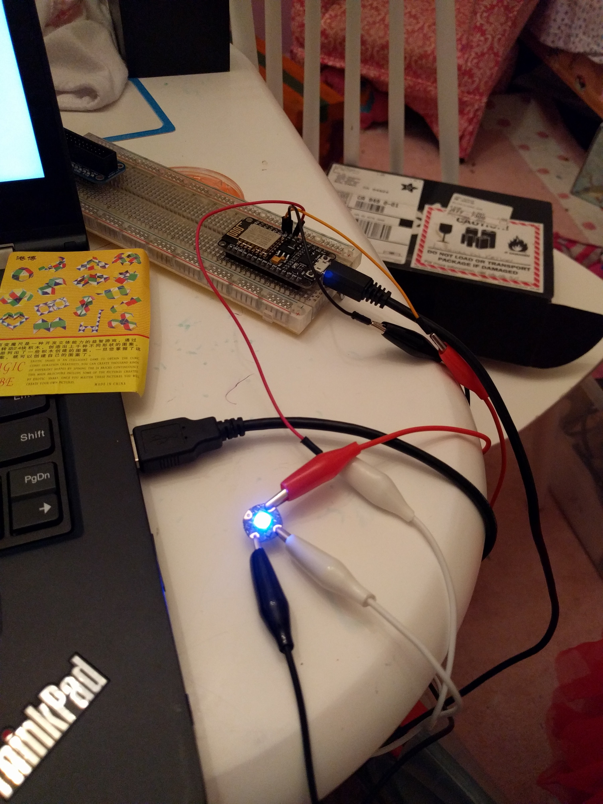
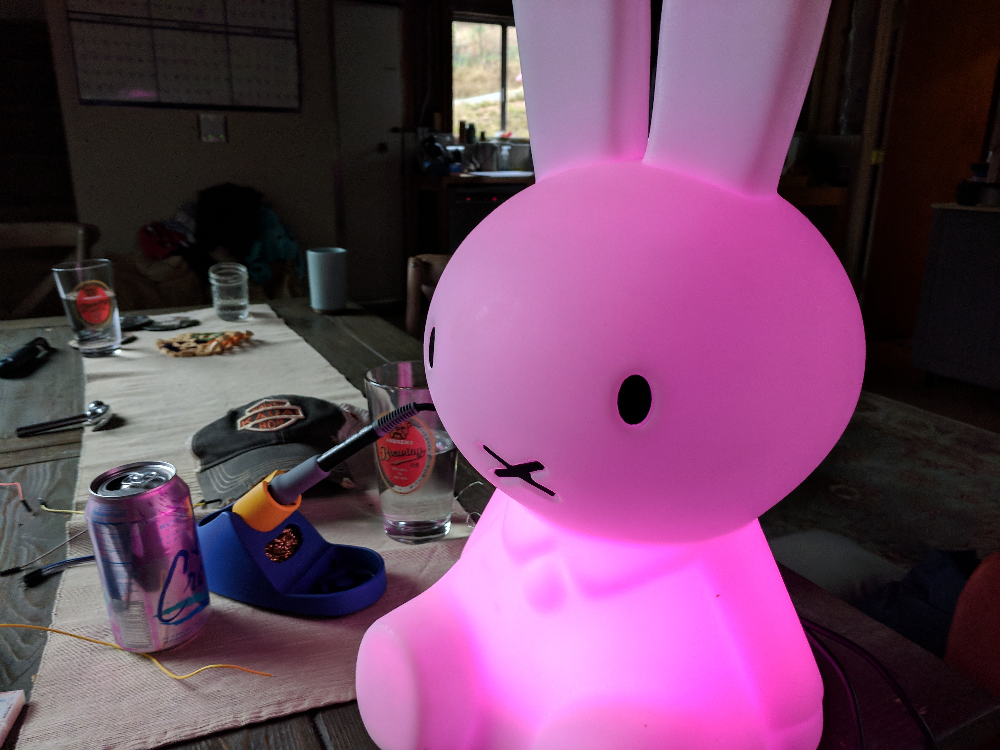

# Miffy's Super Powers

When my oldest daughter was born, one my dearest friend [Britt Selvitelle](https://twitter.com/bs) gave us a gift of [Miffy Lamp](https://mrmaria.com/miffy-xl-lamp/) from Japan.

Figure 1: Mr Maria Miffy Lamp

## My problems with power

Miffy had two "problems", the first being the power cord for the lamp didn't fit into american outlets. The second was the bulb being incandescent consumed lots of power and created lots of heat (and rather bright if I remember correctly).

## Solution: Let's put it on the internet!

Having learned about ESP-8266, a cheap & tiny microcontroller that has WiFi, I thought it would be cool to give the bunny an API.

I grabbed an [AdaFruit](https://adafruit.com) NeoPixel (RGB led), and figured out how to wire it up to ESP8266 (seen in the breadboard below)

After adapting the code to connect to my WiFi, I found code that implemented a webserver on the ESP8266.

This allowed me to expose an API to change the brightness and color via HTTP calls.

Figure 2: Miffy's new brain & light

## Build

The build was pretty simple. After prototyping the circuit design and field testing it with my daughters (using it as a night light), I decided to upgrade from a single NeoPixel to a [16 LED NeoPixel Ring](https://www.adafruit.com/product/1463). This allows more light and some interesting patterns.

Figure 3: Miffy put back together, glowing

A quick solder job, then I hot glued the circuit where the lamp had been attached.

## Exposing the API

While it was cool having an API and webpage to change the colors, I decided to explore integration with Google Home via [ifftt](https://ifttt.com) (if this then that - a web service that lets you connect APIs together with minimal fuss).

Enabling IFTTT to talk to my web service required me to punch a hole in my router to expose bunny to the internet.

Now you could ask google to change the color of the light.

+-------+   +-------------+   +------------+   +------------+
| human +-->| google home +-->| google.com |-->| ifttt.com  |
+-------+   +-------------+   +------------+   +-----+------+
                                                     |
                                                     v
                           +--------------------------------+
                           | my-house-domain/bunnyapi?color |
                           +----------+---------------------+
                                      |
                                      v
+--------------+   +---------+    +-------+
| bunny lights |<--+ esp8266 |<--+ router |
+--------------+   +---------+    +-------+

## A better nightlight

My kids like the lights to be brighter when going to bed, but stay in bed longer if the light isn't as bright through the night.

I was able to add logic to set the light brightness higher during bedtime, but then fade slowly over the next hour.